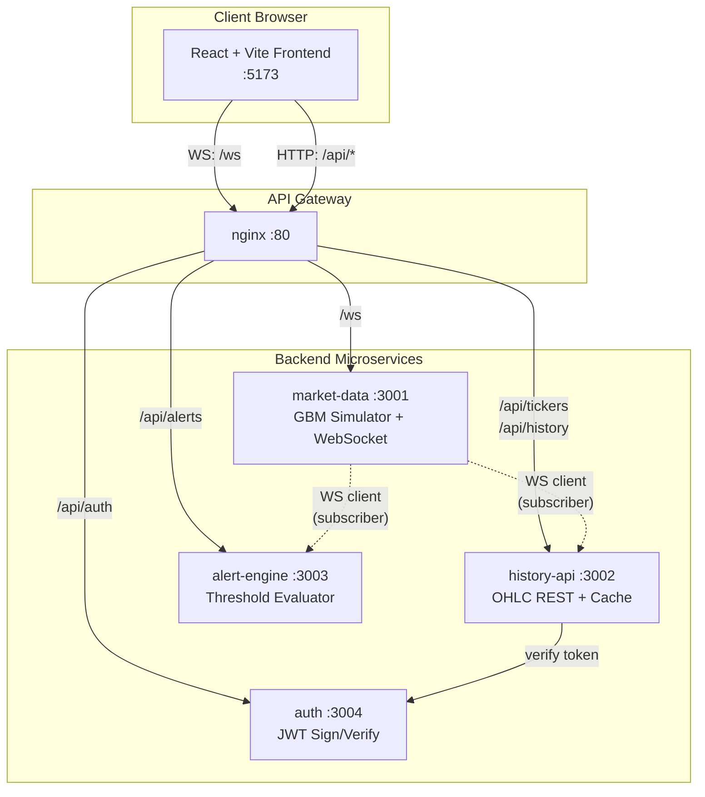

# System Architecture Overview

```mermaid
flowchart TB
    subgraph Client["Client Browser"]
        FE["React + Vite Frontend\n:5173"]
    end

    subgraph Gateway["API Gateway"]
        NG["nginx :80"]
    end

    subgraph Services["Backend Microservices"]
        MD["market-data :3001\nGBM Simulator + WebSocket"]
        HA["history-api :3002\nOHLC REST + Cache"]
        AE["alert-engine :3003\nThreshold Evaluator"]
        AU["auth :3004\nJWT Sign/Verify"]
    end

    FE -->|"WS: /ws"| NG
    FE -->|"HTTP: /api/*"| NG

    NG -->|"/ws"| MD
    NG -->|"/api/tickers\n/api/history"| HA
    NG -->|"/api/alerts"| AE
    NG -->|"/api/auth"| AU

    MD -.->|"WS client\n(subscriber)"| HA
    MD -.->|"WS client\n(subscriber)"| AE
    HA -->|"verify token"| AU
```
