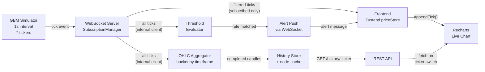

# Data Flow — Live Price Pipeline

```mermaid
flowchart LR
    GBM["GBM Simulator\n1s interval\n7 tickers"] -->|"tick event"| WSS["WebSocket Server\nSubscriptionManager"]
    WSS -->|"filtered ticks\n(subscribed only)"| FE["Frontend\nZustand priceStore"]
    WSS -->|"all ticks\n(internal client)"| AGG["OHLC Aggregator\nbucket by timeframe"]
    WSS -->|"all ticks\n(internal client)"| EVAL["Threshold\nEvaluator"]

    AGG -->|"completed candles"| STORE["History Store\n+ node-cache"]
    STORE -->|"GET /history/:ticker"| REST["REST API"]

    EVAL -->|"rule matched"| ALERT["Alert Push\nvia WebSocket"]
    ALERT -->|"alert message"| FE

    FE -->|"appendTick()"| CHART["Recharts\nLive Chart"]
    REST -->|"fetch on\nticker switch"| CHART
```
