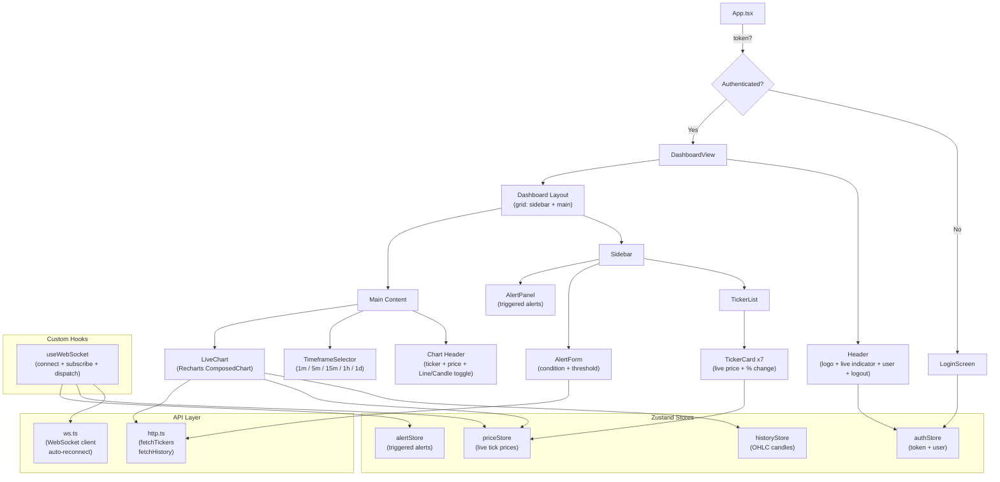

# Frontend Component Architecture

```mermaid
flowchart TB
    APP["App.tsx"] -->|"token?"| AUTH_CHECK{Authenticated?}
    AUTH_CHECK -->|"No"| LOGIN["LoginScreen"]
    AUTH_CHECK -->|"Yes"| DASH["DashboardView"]

    DASH --> HEADER["Header\n(logo + live indicator + user + logout)"]
    DASH --> LAYOUT["Dashboard Layout\n(grid: sidebar + main)"]

    LAYOUT --> SIDEBAR["Sidebar"]
    LAYOUT --> MAIN["Main Content"]

    SIDEBAR --> TLIST["TickerList"]
    TLIST --> TCARD["TickerCard x7\n(live price + % change)"]
    SIDEBAR --> AFORM["AlertForm\n(condition + threshold)"]
    SIDEBAR --> APANEL["AlertPanel\n(triggered alerts)"]

    MAIN --> CHART_HEADER["Chart Header\n(ticker + price + Line/Candle toggle)"]
    MAIN --> TF["TimeframeSelector\n(1m / 5m / 15m / 1h / 1d)"]
    MAIN --> LCHART["LiveChart\n(Recharts ComposedChart)"]

    subgraph Stores["Zustand Stores"]
        PS["priceStore\n(live tick prices)"]
        HS["historyStore\n(OHLC candles)"]
        AS["alertStore\n(triggered alerts)"]
        AUS["authStore\n(token + user)"]
    end

    subgraph Hooks["Custom Hooks"]
        WH["useWebSocket\n(connect + subscribe + dispatch)"]
    end

    subgraph API["API Layer"]
        WSC["ws.ts\n(WebSocket client\nauto-reconnect)"]
        HTTP["http.ts\n(fetchTickers\nfetchHistory)"]
    end

    WH --> WSC
    WH --> PS
    WH --> AS
    LCHART --> HS
    LCHART --> PS
    LOGIN --> AUS
    HEADER --> AUS
    TCARD --> PS
    AFORM --> HTTP
    LCHART --> HTTP
```
