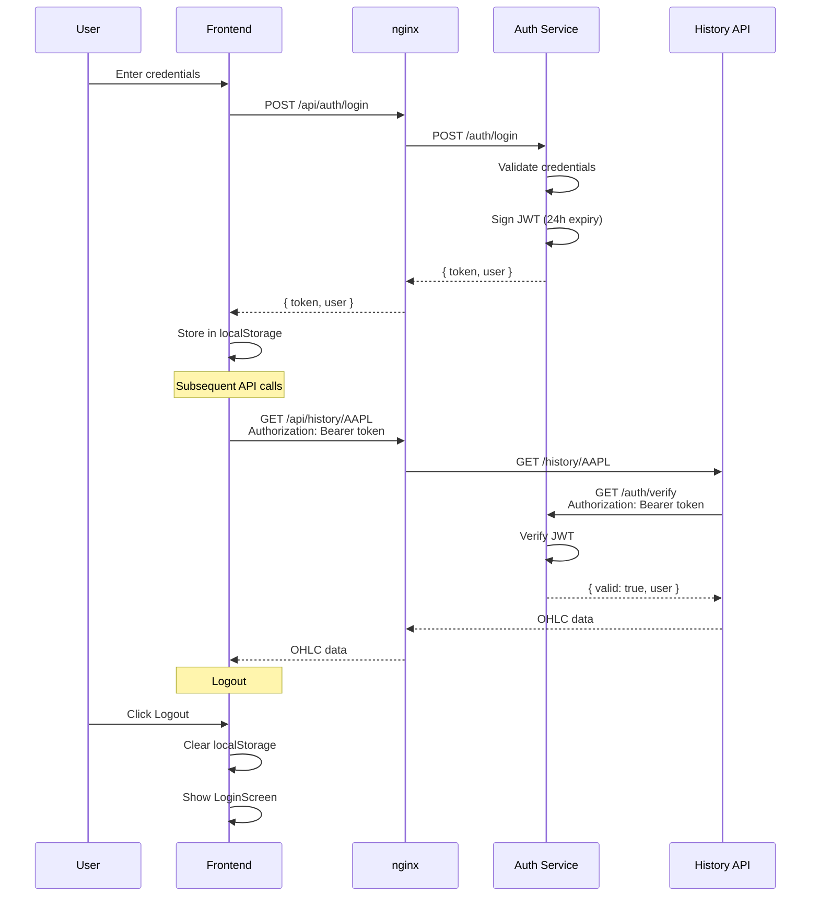

# Authentication Flow

```mermaid
sequenceDiagram
    participant U as User
    participant FE as Frontend
    participant NG as nginx
    participant AU as Auth Service
    participant HA as History API

    U->>FE: Enter credentials
    FE->>NG: POST /api/auth/login
    NG->>AU: POST /auth/login
    AU->>AU: Validate credentials
    AU->>AU: Sign JWT (24h expiry)
    AU-->>NG: { token, user }
    NG-->>FE: { token, user }
    FE->>FE: Store in localStorage

    Note over FE: Subsequent API calls

    FE->>NG: GET /api/history/AAPL<br/>Authorization: Bearer token
    NG->>HA: GET /history/AAPL
    HA->>AU: GET /auth/verify<br/>Authorization: Bearer token
    AU->>AU: Verify JWT
    AU-->>HA: { valid: true, user }
    HA-->>NG: OHLC data
    NG-->>FE: OHLC data

    Note over FE: Logout

    U->>FE: Click Logout
    FE->>FE: Clear localStorage
    FE->>FE: Show LoginScreen
```
