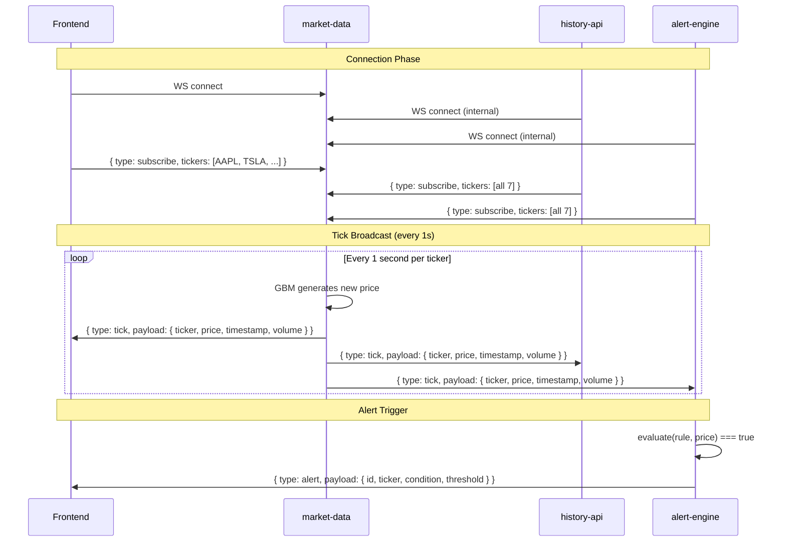

# WebSocket Message Flow

```mermaid
sequenceDiagram
    participant FE as Frontend
    participant MD as market-data
    participant HA as history-api
    participant AE as alert-engine

    Note over FE,AE: Connection Phase

    FE->>MD: WS connect
    HA->>MD: WS connect (internal)
    AE->>MD: WS connect (internal)

    FE->>MD: { type: subscribe, tickers: [AAPL, TSLA, ...] }
    HA->>MD: { type: subscribe, tickers: [all 7] }
    AE->>MD: { type: subscribe, tickers: [all 7] }

    Note over FE,AE: Tick Broadcast (every 1s)

    loop Every 1 second per ticker
        MD->>MD: GBM generates new price
        MD->>FE: { type: tick, payload: { ticker, price, timestamp, volume } }
        MD->>HA: { type: tick, payload: { ticker, price, timestamp, volume } }
        MD->>AE: { type: tick, payload: { ticker, price, timestamp, volume } }
    end

    Note over AE,FE: Alert Trigger

    AE->>AE: evaluate(rule, price) === true
    AE->>FE: { type: alert, payload: { id, ticker, condition, threshold } }
```
