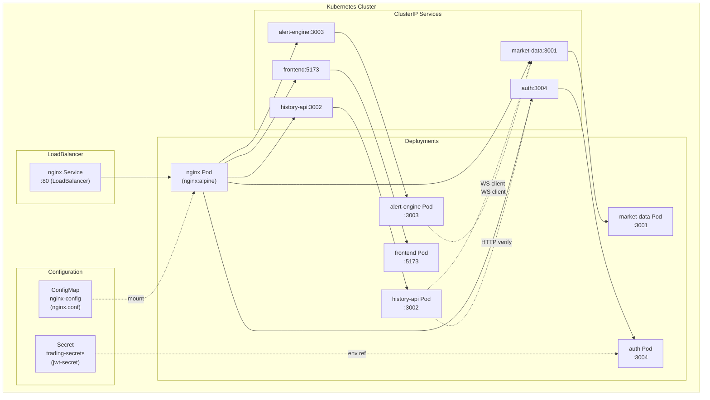

# Kubernetes Deployment Architecture

```mermaid
flowchart TB
    subgraph K8s["Kubernetes Cluster"]
        subgraph Ingress["LoadBalancer"]
            NGSVC["nginx Service\n:80 (LoadBalancer)"]
        end

        subgraph Pods["Deployments"]
            NGD["nginx Pod\n(nginx:alpine)"]
            MDD["market-data Pod\n:3001"]
            HAD["history-api Pod\n:3002"]
            AED["alert-engine Pod\n:3003"]
            AUD["auth Pod\n:3004"]
            FED["frontend Pod\n:5173"]
        end

        subgraph Config["Configuration"]
            CM["ConfigMap\nnginx-config\n(nginx.conf)"]
            SEC["Secret\ntrading-secrets\n(jwt-secret)"]
        end

        subgraph SVCs["ClusterIP Services"]
            MDSVC["market-data:3001"]
            HASVC["history-api:3002"]
            AESVC["alert-engine:3003"]
            AUSVC["auth:3004"]
            FESVC["frontend:5173"]
        end
    end

    NGSVC --> NGD
    NGD --> MDSVC
    NGD --> HASVC
    NGD --> AESVC
    NGD --> AUSVC
    NGD --> FESVC

    MDSVC --> MDD
    HASVC --> HAD
    AESVC --> AED
    AUSVC --> AUD
    FESVC --> FED

    CM -.->|"mount"| NGD
    SEC -.->|"env ref"| AUD

    HAD -.->|"WS client"| MDSVC
    AED -.->|"WS client"| MDSVC
    HAD -.->|"HTTP verify"| AUSVC
```
