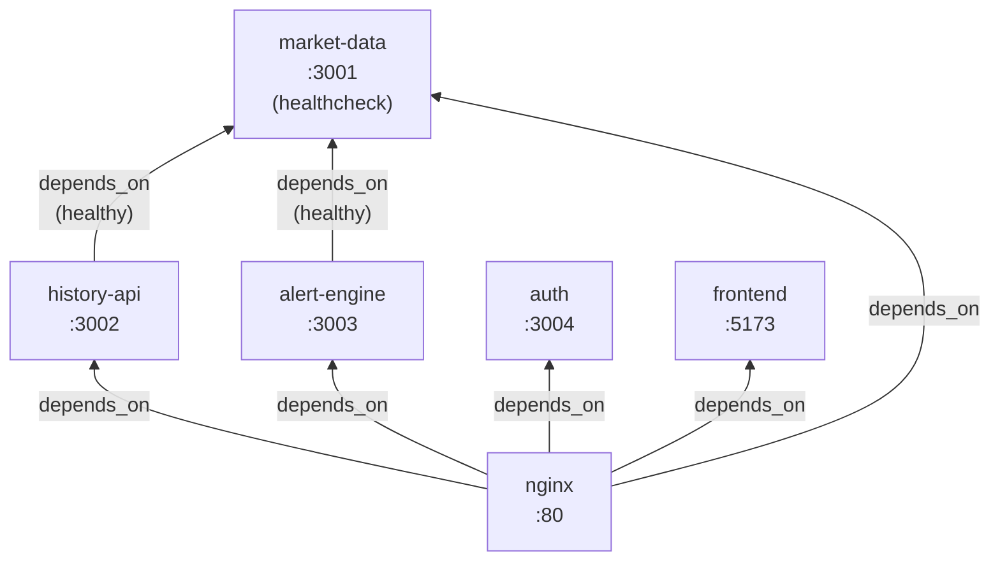

# Docker Compose Service Dependencies

```mermaid
flowchart BT
    MD["market-data\n:3001\n(healthcheck)"]
    HA["history-api\n:3002"]
    AE["alert-engine\n:3003"]
    AU["auth\n:3004"]
    FE["frontend\n:5173"]
    NG["nginx\n:80"]

    HA -->|"depends_on\n(healthy)"| MD
    AE -->|"depends_on\n(healthy)"| MD
    NG -->|"depends_on"| MD
    NG -->|"depends_on"| HA
    NG -->|"depends_on"| AE
    NG -->|"depends_on"| AU
    NG -->|"depends_on"| FE
```
