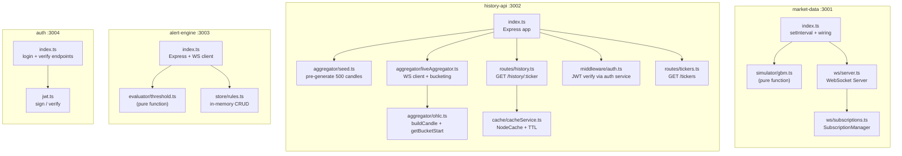

# Backend Service Internal Architecture

```mermaid
flowchart TB
    subgraph MD["market-data :3001"]
        direction TB
        GBM["simulator/gbm.ts\n(pure function)"]
        SM["ws/subscriptions.ts\nSubscriptionManager"]
        WS["ws/server.ts\nWebSocket Server"]
        IDX1["index.ts\nsetInterval + wiring"]
        IDX1 --> GBM
        IDX1 --> WS
        WS --> SM
    end

    subgraph HA["history-api :3002"]
        direction TB
        SEED["aggregator/seed.ts\npre-generate 500 candles"]
        OHLC["aggregator/ohlc.ts\nbuildCandle + getBucketStart"]
        LIVE["aggregator/liveAggregator.ts\nWS client + bucketing"]
        CACHE["cache/cacheService.ts\nNodeCache + TTL"]
        AUTH_MW["middleware/auth.ts\nJWT verify via auth service"]
        R_TICK["routes/tickers.ts\nGET /tickers"]
        R_HIST["routes/history.ts\nGET /history/:ticker"]
        IDX2["index.ts\nExpress app"]
        IDX2 --> SEED
        IDX2 --> LIVE
        LIVE --> OHLC
        R_HIST --> CACHE
        IDX2 --> AUTH_MW
        IDX2 --> R_TICK
        IDX2 --> R_HIST
    end

    subgraph AE["alert-engine :3003"]
        direction TB
        THRESH["evaluator/threshold.ts\n(pure function)"]
        RULES["store/rules.ts\nin-memory CRUD"]
        IDX3["index.ts\nExpress + WS client"]
        IDX3 --> THRESH
        IDX3 --> RULES
    end

    subgraph AU["auth :3004"]
        direction TB
        JWT["jwt.ts\nsign / verify"]
        IDX4["index.ts\nlogin + verify endpoints"]
        IDX4 --> JWT
    end
```
